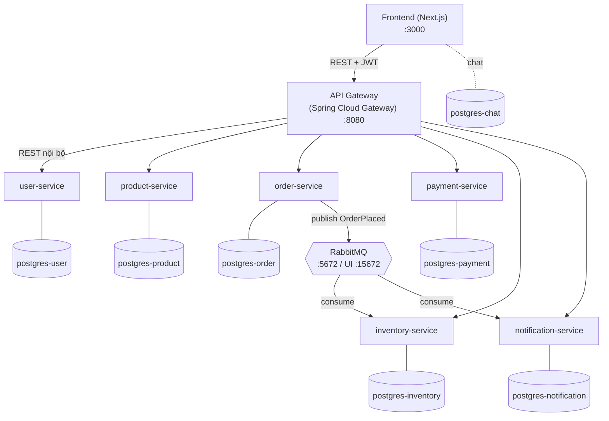
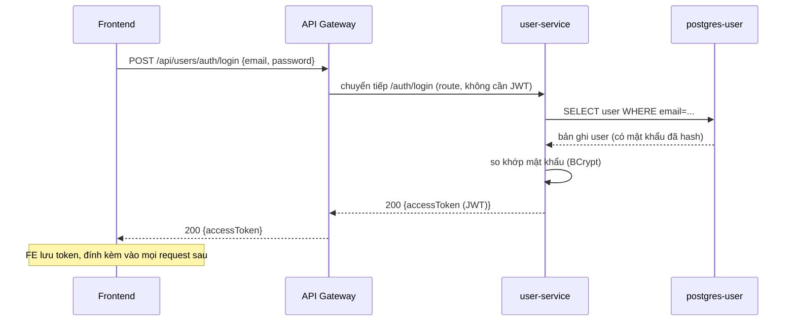
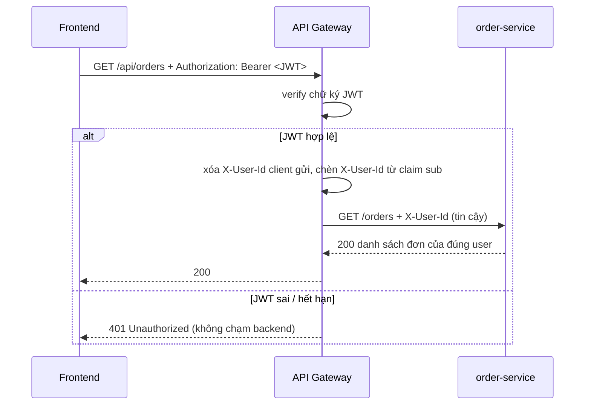
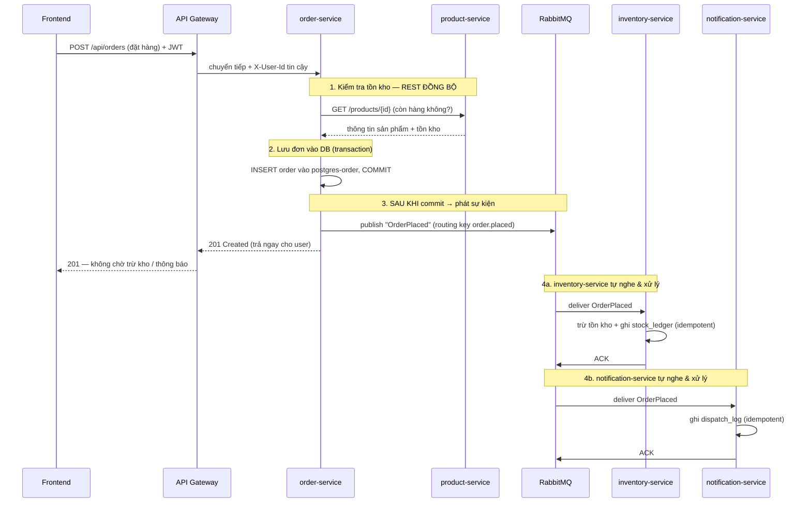

# Kiến trúc hệ thống — Sàn TMĐT Microservices

> Tài liệu tổng hợp kiến trúc thực tế của hệ thống tại thời điểm hiện tại
> (sau Phase 23 — Message Queue, Phase 24 — Database Per Service, Phase 25 —
> Gateway JWT). Mô tả thành phần, luồng giao tiếp đồng bộ và bất đồng bộ.

---

## 1. Tổng quan

Hệ thống là một sàn thương mại điện tử xây theo **kiến trúc microservices**, gồm:

- **1 Frontend** — Next.js (React), giao diện người dùng + admin.
- **1 API Gateway** — Spring Cloud Gateway, cổng vào duy nhất của backend.
- **6 backend service** — Spring Boot (Java 17): `user`, `product`, `order`,
  `payment`, `inventory`, `notification`.
- **7 PostgreSQL** — mỗi service một database riêng (database-per-service).
- **1 RabbitMQ** — message broker cho giao tiếp bất đồng bộ.

Hai mô hình giao tiếp được dùng song song:

| Kiểu | Khi nào dùng | Ví dụ |
|------|--------------|-------|
| **REST đồng bộ** (sync) | Client cần kết quả ngay; thao tác đọc/ghi tức thời | Đăng nhập, xem sản phẩm, kiểm tra tồn kho khi đặt hàng |
| **Message Queue bất đồng bộ** (async) | Xử lý nền, không bắt client chờ; tách rời service | Sau khi đặt hàng → trừ kho + ghi thông báo |

---

## 2. Sơ đồ thành phần (Container Diagram)



**Điểm cốt lõi của kiến trúc:**

1. **API Gateway là cổng vào duy nhất.** 6 backend service KHÔNG expose port ra
   host — chỉ truy cập được trong mạng nội bộ Docker. Mọi request từ trình duyệt
   bắt buộc đi qua Gateway cổng 8080.
2. **Mỗi service một database riêng.** Không service nào truy cập trực tiếp DB
   của service khác. Muốn lấy dữ liệu chéo → gọi REST hoặc qua event.
3. **RabbitMQ tách rời producer và consumer.** order-service không gọi trực tiếp
   inventory/notification mà chỉ "phát" sự kiện; các service kia tự "nghe" và xử lý.

---

## 3. Thành phần chi tiết

### 3.1. Frontend (Next.js)

- Render giao diện, giữ JWT (access token) sau khi đăng nhập.
- Mọi lời gọi API trỏ tới `http://localhost:8080` (API Gateway), kèm header
  `Authorization: Bearer <token>`.
- Có một phần dùng database riêng (`postgres-chat`) cho tính năng chat — đây là
  ngoại lệ kỹ thuật của Next.js server-side, không phải backend service.

### 3.2. API Gateway

- **Định tuyến (routing):** ánh xạ đường dẫn `/api/...` của client sang service
  nội bộ. Ví dụ: `/api/products/**` → `product-service`, `/api/orders/**` →
  `order-service`.
- **Xác thực ở biên (edge authentication — Phase 25):** Gateway tự verify chữ ký
  JWT trên mọi request cần đăng nhập. Token hợp lệ → cho qua; sai/hết hạn → trả
  `401` ngay tại Gateway, request không bao giờ chạm tới backend.
- **Chống giả mạo danh tính:** Gateway **xóa** mọi header `X-User-Id` do client
  tự gửi, rồi **tự chèn lại** `X-User-Id` lấy từ claim `sub` trong JWT đã verify.
  Backend chỉ tin `X-User-Id` đến từ Gateway.

### 3.3. Sáu backend service

| Service | Trách nhiệm | Database |
|---------|-------------|----------|
| **user-service** | Đăng ký, đăng nhập, hồ sơ người dùng, địa chỉ; **phát hành JWT** | `user_svc` |
| **product-service** | Danh mục, sản phẩm, tìm kiếm, đánh giá | `product_svc` |
| **order-service** | Giỏ hàng, đặt hàng, coupon; **phát sự kiện OrderPlaced** | `order_svc` |
| **payment-service** | Xử lý thanh toán | `payment_svc` |
| **inventory-service** | Tồn kho; **tiêu thụ sự kiện** để trừ kho | `inventory_svc` |
| **notification-service** | Ghi nhật ký thông báo; **tiêu thụ sự kiện** | `notification_svc` |

### 3.4. Hạ tầng dữ liệu

- **7 container PostgreSQL độc lập**, mỗi cái có credential + volume riêng.
- Schema + dữ liệu seed được tạo tự động khi service khởi động, bằng **Flyway
  migration** (các file `V1__*.sql`, `V2__*.sql`... trong mỗi service).

### 3.5. RabbitMQ

- Message broker đứng giữa, nhận sự kiện từ producer và chuyển tới các consumer.
- Có **Management UI** tại `http://localhost:15672` để quan sát exchange, queue,
  message trực quan — rất tiện cho việc demo.

---

## 4. Luồng giao tiếp đồng bộ (REST) — ví dụ: Đăng nhập



**Sau khi đăng nhập**, mọi request cần quyền (ví dụ xem đơn hàng) đi như sau:



---

## 5. Luồng giao tiếp bất đồng bộ (RabbitMQ) — ví dụ: Đặt hàng

Đây là luồng quan trọng nhất, thể hiện cả 3 phase 23/24/25 cùng hoạt động.



**Vì sao tách đồng bộ / bất đồng bộ ở đây:**

- **Bước 1 (kiểm tra tồn kho) phải đồng bộ** — nếu hết hàng, user cần biết NGAY
  để không đặt được đơn lỗi.
- **Bước 4 (trừ kho, ghi thông báo) bất đồng bộ** — user không cần chờ. Đơn đã
  lưu thành công là đủ để phản hồi `201`. Việc trừ kho và ghi log thông báo chạy
  nền. Nhờ vậy, nếu notification-service tạm chết, order-service **vẫn** tạo đơn
  bình thường — message chờ trong queue, khi service sống lại sẽ xử lý tiếp.

---

## 6. Topology RabbitMQ (chi tiết kỹ thuật)

```
order-service  ──publish──►  Exchange "order.events" (type: topic)
                                      │  routing key: order.placed
                                      │  binding: order.#
                          ┌───────────┴───────────┐
                          ▼                       ▼
            Queue "inventory.order-events"   Queue "notification.order-events"
                          │                       │
                          ▼                       ▼
                  inventory-service        notification-service

   Nếu consumer xử lý lỗi → retry 3 lần → vẫn lỗi → message rơi vào:
                          ▼
            Exchange "order.dlx" → Queue "order-events.dlq" (Dead Letter Queue)
```

- **Exchange `order.events`** loại *topic* — nhận sự kiện, định tuyến theo
  routing key tới các queue.
- **Hai queue riêng** cho hai consumer — mỗi service nhận một bản sao của sự
  kiện và xử lý độc lập.
- **Dead Letter Queue (`order-events.dlq`)** — "thùng chứa" message lỗi: sau 3
  lần retry không thành công, message được chuyển vào đây để không chặn hàng đợi
  và để admin kiểm tra sau.

---

## 7. Bảng cổng (port) truy cập

| Thành phần | URL / Port | Ghi chú |
|------------|------------|---------|
| Frontend | http://localhost:3000 | Giao diện web |
| API Gateway | http://localhost:8080 | Cổng API duy nhất |
| RabbitMQ Management UI | http://localhost:15672 | guest / guest |
| 6 backend service | (không expose) | Chỉ truy cập trong mạng Docker |
| 7 PostgreSQL | (không expose) | `docker exec` để truy vấn |

---

## 8. Đáp ứng yêu cầu đề chủ đề 4

| Yêu cầu | Hiện thực trong hệ thống |
|---------|--------------------------|
| Kiến trúc microservice | 6 backend service tách theo nghiệp vụ + API Gateway |
| Message Queue (3.3) | RabbitMQ — luồng OrderPlaced async (Phase 23) |
| Xử lý lỗi message (3.5) | Retry 3 lần + Dead Letter Queue |
| Database per service (3.4) | 7 PostgreSQL container độc lập (Phase 24) |
| Chịu lỗi độc lập (mục 4) | 1 DB chết → các service khác vẫn chạy |
| Bảo mật / xác thực | JWT verify ở Gateway, chống giả mạo X-User-Id (Phase 25) |

> Hướng dẫn chứng minh + kịch bản demo trước hội đồng: xem
> [DEMO-RABBITMQ-DB.md](./DEMO-RABBITMQ-DB.md).
